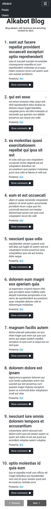
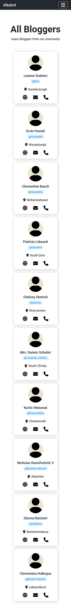
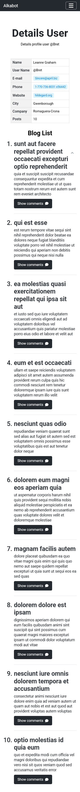
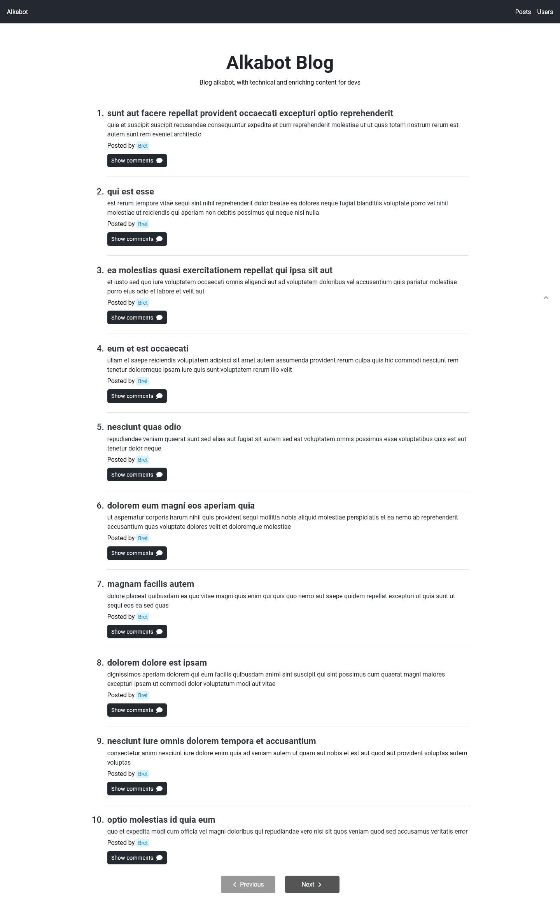
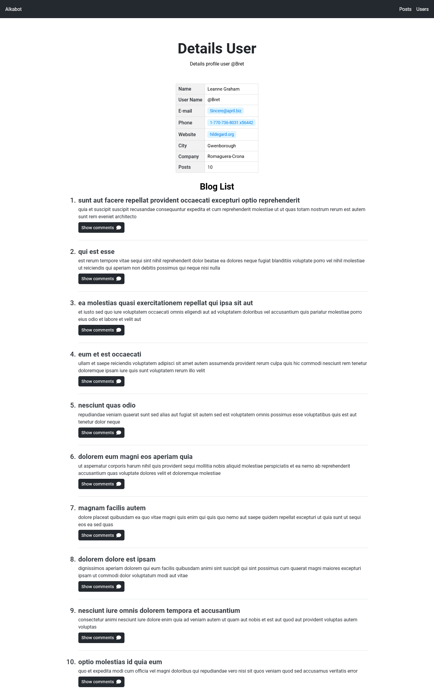

# Teste prático vaga desenvolvedor Front-End Junior alkabot

A equipe recebeu uma demanda para desenvolver um front-end para uma API RESTful. No
cenário proposto, a interface deve exibir posts de um blog e, ao clicar em um post, os
comentários associados.

 - [x] Interface deve exibir posts de um blog.
 - [x] Clicar em um post, deve exibir os comentários associados.

## Tabela de conteúdos

- [Visão Geral](#visão-geral)
 - [Tarefa](#a-tarefa)
 - [PrintScreens](#print-screens)
 - [Links](#links)
- [Process](#processo)
 - [Construido Com](#construido-com)
- [Instalação e Execução da aplicação](#instalação-e-execução-do-projeto)

## Visão Geral

### A Tarefa

Você ficou responsável pela demanda e sua tarefa é projetar uma interface para atender as
necessidades. Os seguintes serviços estão disponíveis:

 - Listagem de posts: https://jsonplaceholder.typicode.com/posts
 - Listagem de comentários de um post:
o https://jsonplaceholder.typicode.com/posts/[ID]/comments
 - Listagem de usuários:
o https://jsonplaceholder.typicode.com/users
 - Detalhes de um usuário:
o https://jsonplaceholder.typicode.com/users/[ID]

### Print Screens

#### Resultado Mobile







#### Resultado Desktop






### Links

 - URL Repositório: [Repositorio Projeto]()
 - Url Aplicação: [Resultado Aplicação]()

## Processo

### Construido Com

- Marcação HTML semântica
- CSS(Flexbox, Grid, Bem Metodolody CSS Architecture)
- Mobile-first workflow, Responsive Web Design(RWD)
- Acessibilidade Web com arias atributos, é roles
- Typescript
- FETCH API Web
- React JS library
  - Hooks React
  - React router-dom-library
- NPM
- Ferramenta de construção Vite - [Vite](https://pt.vitejs.dev/guide/)
- Normalize CSS - [Normalize](https://necolas.github.io/normalize.css/)
- Font Awesome Icons - [Font Awesome](https://fontawesome.com/docs/web/use-with/react/) - Icons

## Instalação e Execução do Projeto

Neste projeto usamos o kit de ferramentas Tooling vite com react é typescript

### Criar projeto vite

```sh
npm create vite@latest
```

depois so seguir as instruções e escolher as opções de template fornecidas, de acordo com a necessidade do projeto.

### Instalar depêndencias

O vite não instala as dependencias somente as especifica, para instalar todas depencias e instalar a pasta node-modules para executar o projeto

```sh
npm install
```

### Executando o projeto no modo Dev

Apos instalar dependencias iniciais podemos iniciar nosso projeto e começar a trabalhar, iniciamos executando o servidor de desenvolvimento, rodar o projeto no modo de desenvolvimento

```sh
npm run dev
```

### Build para production

fazendo o build para produção

```sh
npm run build
```

### ESLint é Prettier Ferramentas

#### Instalar ESLint para checagem de tipos e encontrar problemas no codigo

instalar e configurar, apos executar o comando, so seguir as intruções, e escolher as opções que encaixam de acordo com as ferramentas que serão necessarias para seu projeto.

```sh
npm init @eslint/config
```

#### Plugins ESLint

eslint-plugin-jsx-a11y

Verificador AST estático para regras de acessibilidade em elementos JSX.

```sh
npm install eslint-plugin-jsx-a11y --save-dev
```

Uso

Você também pode habilitar todas as regras recomendadas ou estritas de uma só vez. Adicionar `plugin:jsx-a11y/recommended` ou `plugin:jsx-a11y/strict` em extends:

```sh
{
  "extends": ["plugin:jsx-a11y/recommended"]
}
```

#### Prettier

instale o Prettier localmente

```sh
npm install --save-dev --save-exact prettier
```

Em seguida, crie um arquivo de configuração vazio para permitir que os editores e outras ferramentas saibam que você está usando o Prettier:

```sh
echo {}> .prettierrc.json
```

Desativa todas as regras desnecessárias ou que possam entrar em conflito com o Prettier.

```sh
npm install --save-dev eslint-config-prettier
```

Em seguida, adicione `"prettier"` à matriz "extends" em seu `.eslintrc.*` arquivo. Certifique-se de colocá-lo por último, para que tenha a chance de substituir outras configurações.

```sh
{
  "extends": [
    "some-other-config-you-use",
    "prettier"
  ]
}
```
